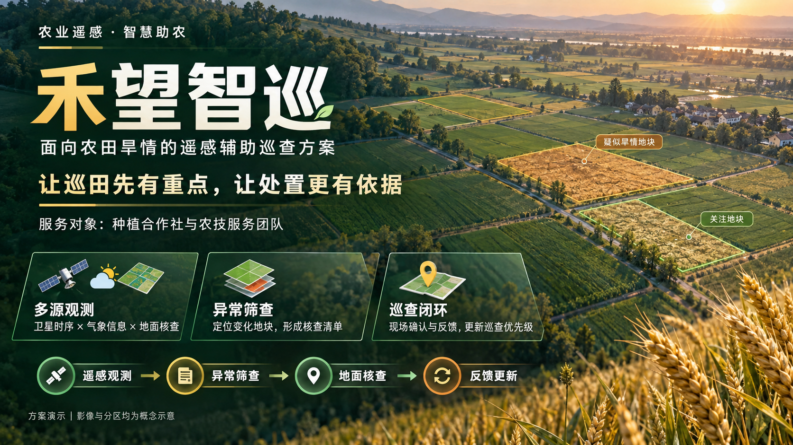

# PPT 工作流 3.0｜只图版

**把完整页面图直接作为每一页 PPT，保留你选中的原图效果。**

3.0 的取舍很明确：优先保留画面的字体效果、构图、光影与材质。每页 PPT 只有一张完整图片，页内文字和图形不再拆成可编辑对象。

> 想法 + 文字说明 + 参考资源 → 多种完整页面方向 → 选择与修改 → 整套页面图片 → 只图版 PPT

[阅读使用指南](docs/使用指南.md) · [查看三页示例](examples/agri-remote-sensing/demo.pptx) · [使用工作流技能](SKILL.md) · [复制项目说明模板](templates/brief.md)



## 为什么做 3.0

在农业遥感竞赛小样中，原生文字与图层重建虽然带来了可编辑性，却改变了原图的字体、立体图标和局部细节。用户更喜欢原图效果，因此 3.0 把任务收敛到**设计好每张整页图片，再把它们装进 PPT**。

这不是把旧流程的所有步骤再包一层。分层、去字、背景修补、艺术字提取、OCR、SVG 转换和可编辑重建都不在本仓库的运行链中，也不需要旧资产库。

## 最简单的使用方法

### 已有页面图片

需要 Python 3.10 或更新版本。组装 PPT 不需要 PowerPoint、不需要生图 API，也不需要密钥。

```bash
git clone https://github.com/jjw-creat/ppt-workflow-3.0-image-only.git
cd ppt-workflow-3.0-image-only
python -m pip install -r requirements.txt
python scripts/images_to_pptx.py examples/agri-remote-sensing/slides -o output/demo.pptx
```

将自己的完整页面放进一个目录，按页码命名：

```text
my-project/
├── brief.md
└── slides/
    ├── 01_封面.png
    ├── 02_问题.png
    └── 03_方案.png
```

```bash
python scripts/images_to_pptx.py my-project/slides -o output/我的演示.pptx
```

目录模式按文件名自然排序，顺序为 1、2、10。目录只读取当前层的 PNG/JPG/JPEG 文件；草稿和未选中的方案请放到别处。也可以明确指定顺序：

```bash
python scripts/images_to_pptx.py cover.png problem.png solution.png -o output/deck.pptx
```

已有同名 PPT 默认不会被覆盖；确认要替换时加 `--force`。

### 从一个想法开始

将 [SKILL.md](SKILL.md) 交给有文件操作和生图能力的助手，或安装为本地技能，然后提供想法、文字和参考素材：

> 使用 PPT 工作流 3.0，只做只图版。我提供想法、文字和参考图；你先设计几张不同风格的完整页面让我选，选定后延展整套，最后每张原图作为一页 PPT。

1. **明确内容。** 在一份 brief 中记下用途、受众、逐页文字和参考资源。
2. **选择视觉方向。** 同一份内容制作约 3 个完整页面方案，用户选择后再批量延展。
3. **制作完整页面。** 每张图包含最终文字、图形与版式；密集页同样先看整页效果。修改直接发生在页面图上。
4. **确认成图。** 核对错字、顺序、可读性、比例和整套风格，把选定版本放入 slides。
5. **组装交付。** 运行图片组装脚本，每图一页；交付 PPT、原图和提示词。

也支持**助手只给提示词，用户去其他工具生图**：提示词应包含完整文案和参考用途，用户将成图放入 slides 后再组装。仓库没有绑定任何图片模型；脚本本身不负责调用生图服务。

## 保留什么，舍弃什么

| 保留 | 不再进入默认流程 |
|---|---|
| 内容规划与参考图理解 | OCR 与文字重建 |
| 完整页生图与局部修改 | 去字底图、透明主体和艺术字提取 |
| 用户选择风格、跨页延展 | SVG 或原生图形重绘 |
| 检查页面文案与视觉效果 | 可编辑性评分与图层合同 |
| 图片顺序、整图组装、原图校验 | 旧版多套状态文件和兼容编译 |

需要可编辑文字时，应另开可编辑工作流处理。不要在 3.0 的交付前自动追加拆层或重建。

## 图片与画布规则

- 支持静态 PNG、JPG、JPEG。建议所有页面都用 16:9，并尽量保持相同尺寸。
- PPT 画布跟随第一张图片的宽高比，因此也支持统一的其他比例。
- 比例差异超过 0.1% 时停止并提示，避免无意裁切或拉伸。极小的像素取整差异会等比居中。
- 直接嵌入原文件，生成时不重新编码、不放大图片、不裁切。脚本逐页验证 PPT 内的图片字节与源文件一致。
- 不添加文本框、页码、标识或装饰；这些应当已经包含在最终页面图中。
- 带 EXIF 旋转的 JPEG 需先在图片工具中按正确方向导出。损坏文件和动画图会被拒绝。
- 画面清晰度取决于原图。原图低分辨率时，放进 PPT 不会凭空增加细节；不同软件的显示与后续另存行为也可能有差异。

## 示例与验证

示例是虚拟农业遥感竞赛项目“禾望智巡”，用于演示视觉工作流，不代表实际产品、实验结果或获奖。示例图片由 AI 生成。

- [项目总览](examples/agri-remote-sensing/slides/01_overview.png)
- [痛点场景](examples/agri-remote-sensing/slides/02_problem.png)
- [技术流程](examples/agri-remote-sensing/slides/03_workflow.png)
- [只图版 PPT](examples/agri-remote-sensing/demo.pptx)
- [示例说明与提示词](examples/agri-remote-sensing/brief.md)

自动测试验证原图字节、每页单图、排序、比例检查、同名文件保护与损坏图片处理：

```bash
python -m unittest discover -s tests -v
```

仓库同时提供 GitHub Actions，在 Windows 和 Linux 上运行这些测试。自动测试不代替对图片中的中文和设计质量进行审阅。

## 仓库结构

```text
README.md
docs/使用指南.md
SKILL.md
VERSION
requirements.txt
scripts/images_to_pptx.py
templates/brief.md
examples/agri-remote-sensing/
tests/test_image_deck.py
.github/workflows/test.yml
```

**3.0 的完成标准：你认可的每张原图，按正确顺序出现在 PPT 中。**
